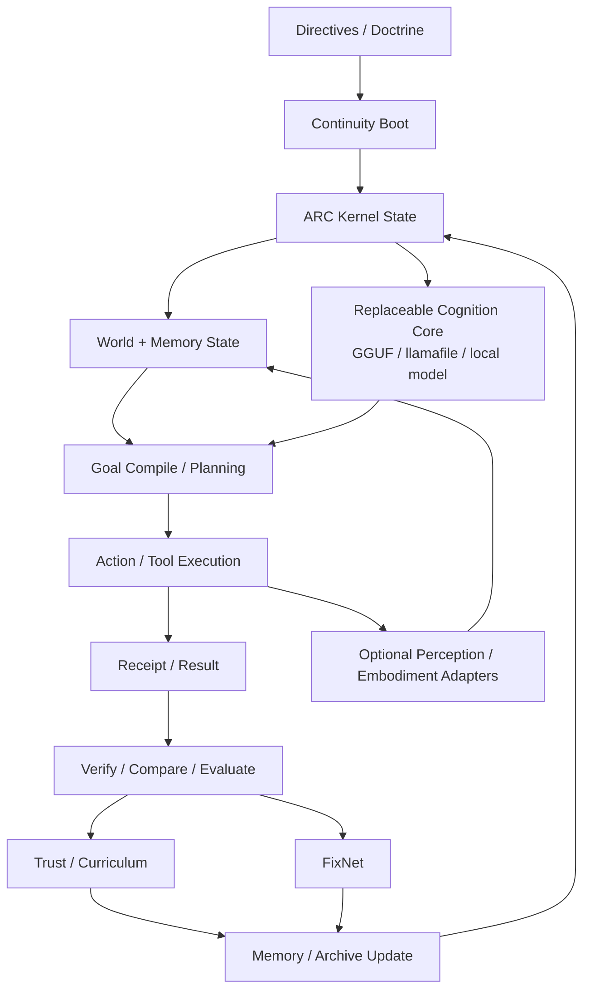
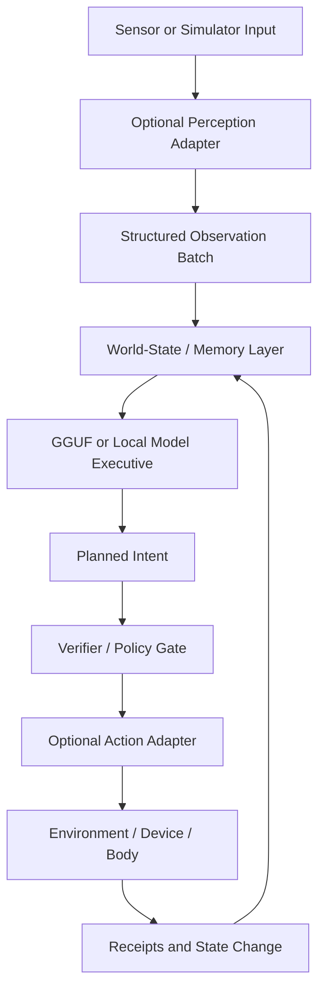
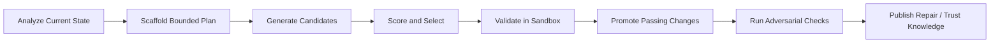
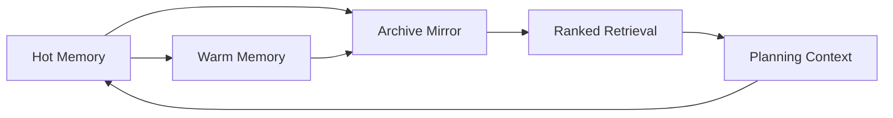
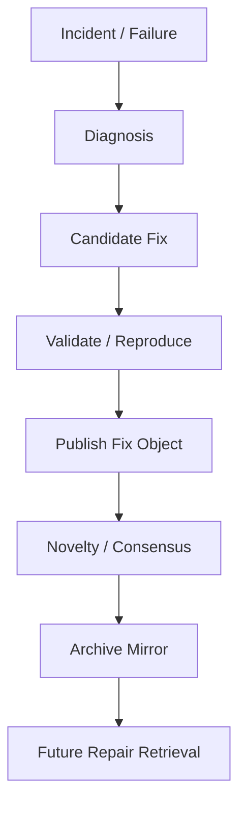

# ARC Lucifer Cleanroom Runtime

[](#validation)
[](#quick-start)
[](LICENSE.md)

A **deterministic local-first AI operator runtime** for building a persistent shell around a replaceable local model.

This repository combines a durable runtime spine with receipts, replay, rollback, policy decisions, ranked memory, archive lineage, exact code editing, self-improvement loops, and a repair-intelligence layer called **FixNet**.

Perception, robotics, multimodal, and embodiment layers are treated as **optional adapters**. The core runtime remains useful and installable without cameras, microphones, robot drivers, or GPU-heavy vision stacks, while still giving you a clean path to attach them when you want them.

It is aimed at people searching for:
- local AI runtime
- GGUF agent framework
- deterministic AI operator
- persistent AI shell
- terminal AI runtime
- local coding agent foundation
- replayable AI workflow engine
- archival memory system for AI agents
- self-improving local agent architecture
- clean-room operator runtime for Python

## Table of contents

- [What this repository is](#what-this-repository-is)
- [Why it exists](#why-it-exists)
- [Current package state](#current-package-state-v2140)
- [Direction goals](#direction-goals)
- [What makes it different](#what-makes-it-different)
- [Architecture walkthrough](#architecture-walkthrough)
- [How the runtime actually works](#how-the-runtime-actually-works)
- [Repository walkthrough](#repository-walkthrough)
- [Quick start](#quick-start)
- [Common commands](#common-commands)
- [Examples walkthrough](#examples-walkthrough)
- [Optional perception and embodiment](#optional-perception-and-embodiment)
- [Self-improvement workflow](#self-improvement-workflow)
- [Memory and archive model](#memory-and-archive-model)
- [FixNet repair intelligence](#fixnet-repair-intelligence)
- [How to visualize it working](#how-to-visualize-it-working)
- [Documentation routing](#documentation-routing)
- [Comparison snapshot](#comparison-snapshot)
- [Production posture](#production-posture)
- [Implementation truth matrix](#implementation-truth-matrix)
- [Runtime modularization note](#runtime-modularization-note)
- [SEO and discoverability notes](#seo-and-discoverability-notes)
- [License](#license)

## What this repository is

ARC Lucifer Cleanroom Runtime is a **persistent local operator runtime** built around these ideas:
- a long-lived directive shell
- a replaceable cognition core such as a local GGUF / llamafile-backed model
- deterministic execution with receipts and replayable state transitions
- resilient fallback modes instead of silent failure
- memory that can stay live, mirror early into archive, and retire on schedule
- repair knowledge that compounds across incidents rather than disappearing into logs

This is **not** a generic chat wrapper and **not** a claim of solved AGI. It is a serious software foundation for building a governed, local-first intelligence shell. It is also intentionally designed so future vision, robotics, audio, simulator, and desktop-control layers can be attached as optional services instead of becoming hard requirements for every install.

## Why it exists

Most public agent systems are optimized for fast coding productivity, cloud workflows, or short-lived sessions.

This project is aimed at a different center of gravity:

> a persistent, directive-bound, local-first runtime with a replaceable reasoning core and a deterministic operational spine

The runtime identity comes from directives, doctrine, runtime state, memory lineage, repair lineage, and the attached cognition/model layer. That means continuity does not disappear when one model run ends.

## Current package state (v2.17.0)

This repository currently includes:
- persistent shared SQLite-backed kernel state
- deterministic file, shell, and code-edit operator flows
- exact line-range and symbol-grounded code editing for Python
- managed local-model execution via llamafile-oriented flows
- rollback, replay, evaluations, policy decisions, and fallback histories
- hot, warm, and archive memory tiers with early archive mirroring and ranked search
- self-improvement analysis, planning, scaffolding, candidate generation, scoring, review, promotion, and adversarial fault injection
- optional bounded robotics bridge for dog-body and tentacle-arm style adapters
- optional local occupancy-grid mapping and route planning
- canonical spatial truth layer for anchors, observations, and confidence summaries
- optional geo overlay layer with anchor-vault and tile summaries
- optional trusted bluetooth bridge with bounded device profiles and local signal generation modes
- goal compilation into constraints, invariants, abort conditions, evidence requirements, and archive mode
- shadow predicted-vs-actual comparison flows
- tool trust tracking and curriculum-memory updates
- directive ledger, continuity boot receipts, heartbeats, and primary/fallback mode tracking
- FixNet repair intelligence with semantic fix lineage and archive-visible mirrors
- operator commands for monitor, info, doctor, export/import, backup, compact, and failures
- bootstrap, smoke-test, and release-check scripts
- docs, examples, tests, and packaging metadata for local development and public GitHub release
- optional adapter contracts for future perception and embodiment surfaces without requiring those stacks by default

## Direction goals

The public direction is now explicit:
- keep the core runtime lightweight, deterministic, and useful on its own
- make multimodal perception and robotics **optional capabilities**, not mandatory dependencies
- let a replaceable GGUF or local-model core reason over structured world state instead of raw sensor noise
- preserve receipts, replay, memory lineage, and safety checks even when richer adapters are enabled
- present the repo honestly as a real autonomy foundation rather than pretending the current code is a finished living machine

## What makes it different

### 1. Deterministic runtime spine
The runtime tracks decisions and actions through receipts, replay, rollback, and policy events rather than treating everything as an opaque model transcript.

### 2. Directive-first continuity
The shell is meant to persist beyond a single model run. Directives, continuity status, and fallback tracking give the system durable intent.

### 3. Memory with archive lineage
Memory can mirror into archive early, stay live until retirement, and keep readable metadata for later ranked retrieval.

### 4. Repair intelligence via FixNet
Fixes are promoted into reusable repair knowledge with lineage, consensus, novelty filtering, and archive mirrors.

### 5. Local-first model openness
The cognition layer is intentionally open-ended. You can use current local-model flows now and still keep the runtime architecture ready for future backends or custom GGUF work later.

## Architecture walkthrough

### System graph



### Reader path

- Start at the [Documentation hub](docs/INDEX.md)
- Read the [architecture walkthrough](docs/architecture.md)
- Read the [design doctrine](docs/doctrine.md)
- Read the [optional perception and embodiment contract](docs/vision_runtime_optional_adapters.md)
- Then go into [memory retention](docs/memory_retention.md) and the [autonomous patch cycle](docs/v2_3_autonomous_patch_cycle.md)

### Main subsystems

#### ARC Kernel
Handles event authority, policy, receipts, replay, rollback, branching, and persistent shared state.

#### Lucifer Runtime
Provides terminal routing, CLI commands, execution helpers, runtime config, and resilience-aware command handling.

#### Cognition Services
Provides goal management, planning, world-model views, evaluator logic, shadow comparison, directives, and persistent-loop behavior.

#### Perception Adapters
Defines optional contracts for vision, audio, simulator, desktop-capture, and other sensor pipelines so raw input can be turned into structured observations without forcing heavyweight dependencies on the base install.

#### Memory Subsystem
Implements hot, warm, and archive memory tiers, ranking, mirror-then-retire archival behavior, and readable metadata surfaces.

#### Self Improve
Runs deterministic improvement loops with analysis, planning, scaffolding, candidate generation, scoring, validation, promotion review, and adversarial fault injection.

#### Code Editing
Supports exact range replacement, symbol-grounded edits, line mapping, patch validation, and code-level planning.

#### FixNet
Stores fix objects, lineage, novelty checks, consensus, and archive mirrors so repair knowledge compounds over time.

#### Verifier / Dashboards / Resilience
Support health checks, monitoring, validation, doctor flows, trace inspection, and fallback-oriented operations.

## How the runtime actually works

### Runtime flow


1. **You define directives or operator goals.**
2. **The runtime compiles intent into bounded work.** Goals become constraints, invariants, evidence requirements, and stop conditions.
3. **The shell executes through controlled adapters.** File, shell, code-edit, model, and optional perception/action adapters are routed through runtime policy rather than free-form mutation.
4. **Every action produces evidence.** Receipts, events, traces, and evaluation results are stored so work can be audited and replayed.
5. **Outcomes are compared and scored.** Shadow logic, evaluators, and validators compare intended results against actual results.
6. **Memory and repair surfaces are updated.** Ranked memory, curriculum updates, and FixNet entries accumulate operational knowledge.
7. **The runtime continues.** State, directives, fallback status, and archive lineage persist across runs.

That is the main point of the project: a local operator runtime that can keep operating with continuity instead of acting like a disposable one-shot chat session.

## Repository walkthrough

```text
src/
  arc_kernel/           core event, policy, state, replay, rollback logic
  lucifer_runtime/      CLI, router, runtime config, command surfaces
  cognition_services/   directives, goals, planner, evaluator, shadow, trust
  memory_subsystem/     memory tiers, ranking, archival behavior
  self_improve/         analysis, candidate generation, scoring, review, promotion
  code_editing/         line/symbol grounded patch workflows
  fixnet/               repair lineage, novelty filtering, fix archive mirrors
  verifier/             verification and health surfaces
  dashboards/           monitor and trace visualization helpers
  model_services/       model-profile and local model integration surfaces
  perception_adapters/  optional vision/audio/robotics adapter contracts
  resilience/           fallback, continuity, and runtime hardening helpers

docs/                   architecture, comparisons, upgrade notes, memory docs
examples/               runnable examples for runtime, loop, memory, llamafile flow
tests/                  automated validation coverage
scripts/                bootstrap, smoke, and release-check scripts
assets/                 public preview assets
```

### Repo-to-doc routing

- `src/arc_kernel/` → [Architecture](docs/architecture.md)
- `src/lucifer_runtime/` → [Architecture](docs/architecture.md) and [llamafile flow](docs/llamafile_flow.md)
- `src/cognition_services/` → [control loops](docs/v2_10_control_loops.md)
- `src/memory_subsystem/` → [memory retention](docs/memory_retention.md) and [memory mirror + stack](docs/v2_4_memory_mirror_and_stack.md)
- `src/self_improve/` → [self-improvement runs](docs/v2_0_self_improve_runs.md) and [autonomous patch cycle](docs/v2_3_autonomous_patch_cycle.md)
- `src/fixnet/` → [FixNet archive embedding](docs/v2_9_1_fixnet_archive_embedding.md)
- `src/perception_adapters/` → [optional perception and embodiment adapters](docs/vision_runtime_optional_adapters.md)
- `tests/` → [benchmarks](docs/benchmarks.md) and release confidence surfaces in this README

## Quick start

### 1. Create a virtual environment

```bash
python3 -m venv .venv
source .venv/bin/activate
python -m pip install -U pip
```

### 2. Install the repo in editable mode

```bash
python -m pip install -e .[dev]
```

### 3. Run tests and smoke validation

```bash
pytest -q
bash scripts/smoke.sh
```

### 4. Explore the CLI

```bash
PYTHONPATH=src python -m lucifer_runtime.cli commands
```

### 5. Optional shortcuts

```bash
make install
make test
make smoke
make release-check
```

## Common commands

### Runtime and health

```bash
PYTHONPATH=src python -m lucifer_runtime.cli commands
PYTHONPATH=src python -m lucifer_runtime.cli state
PYTHONPATH=src python -m lucifer_runtime.cli info
PYTHONPATH=src python -m lucifer_runtime.cli doctor
PYTHONPATH=src python -m lucifer_runtime.cli monitor --watch 2 --iterations 5
PYTHONPATH=src python -m lucifer_runtime.cli failures
```

### Persistence, replay, and repair

```bash
PYTHONPATH=src python -m lucifer_runtime.cli export runtime-export.json
PYTHONPATH=src python -m lucifer_runtime.cli backup backups/
PYTHONPATH=src python -m lucifer_runtime.cli compact
PYTHONPATH=src python -m lucifer_runtime.cli fixnet-list
PYTHONPATH=src python -m lucifer_runtime.cli fixnet-publish "retry timeout patch"
```

### Memory and directives

```bash
PYTHONPATH=src python -m lucifer_runtime.cli memory-list
PYTHONPATH=src python -m lucifer_runtime.cli memory-search "fallback retry"
PYTHONPATH=src python -m lucifer_runtime.cli directive-add "stay local-first"
PYTHONPATH=src python -m lucifer_runtime.cli directive-list
```

## Examples walkthrough

The examples folder gives you the easiest way to understand the repo in motion:

- [`examples/run_runtime.py`](examples/run_runtime.py) shows the base runtime loop
- [`examples/run_persistent_loop.py`](examples/run_persistent_loop.py) shows continuity-oriented execution
- [`examples/run_memory_retention.py`](examples/run_memory_retention.py) shows memory tiering and retention behavior
- [`examples/run_llamafile_stream.py`](examples/run_llamafile_stream.py) shows the local-model execution path

A good first pass is:

```bash
PYTHONPATH=src python examples/run_runtime.py
PYTHONPATH=src python examples/run_memory_retention.py
PYTHONPATH=src python examples/run_persistent_loop.py
```

## Optional perception and embodiment

The repo now makes this contract explicit:
- cameras, microphones, simulators, robot SDKs, and multimodal runtimes are **not required** to install or run the core runtime
- when enabled, those layers should attach through bounded adapter interfaces and still feed structured state back into the same deterministic shell
- the GGUF or local model should reason over summarized observations and world-state facts, not directly own millisecond motor control

### Optional adapter graph



See:
- [Optional vision/runtime adapters](docs/vision_runtime_optional_adapters.md)
- [`src/perception_adapters/`](src/perception_adapters)

## Self-improvement workflow

The self-improvement system is intentionally constrained. It is designed to improve within a deterministic process rather than mutate itself blindly.

### Improvement loop



High-level cycle:
1. analyze the current state
2. scaffold a bounded plan
3. generate candidate changes
4. score the candidates
5. validate in a sandbox
6. promote only passing work
7. run adversarial or fault-injection checks on promoted paths

Relevant source areas:
- [`src/self_improve/`](src/self_improve)
- [`src/code_editing/`](src/code_editing)
- [`src/verifier/`](src/verifier)

## Memory and archive model

The memory subsystem is one of the repo’s distinguishing pieces.

It supports:
- live memory for active operational context
- warm memory for retained but lower-priority context
- archive memory for durable long-term lineage
- early archive mirroring before final retirement
- ranked search back into retained memory
- readable memory metadata rather than opaque vector-only storage

### Memory graph



This makes it easier to preserve continuity while still controlling memory sprawl.

See:
- [Memory retention](docs/memory_retention.md)
- [Memory mirror and stack](docs/v2_4_memory_mirror_and_stack.md)
- [Memory ranking notes](docs/v2_5_memory_ranking_notes.md)

## FixNet repair intelligence

FixNet is the repair-intelligence layer. Instead of treating fixes as disposable troubleshooting notes, the runtime can preserve them as reusable repair objects with lineage.

That includes:
- semantic fix entries
- novelty checks to avoid duplicate noise
- consensus-oriented publication logic
- archive mirrors for long-term retention
- runtime visibility into what has already worked before

### FixNet graph



See:
- [FixNet archive embedding](docs/v2_9_1_fixnet_archive_embedding.md)
- [Resilience and operator comments](docs/v2_2_resilience_and_comments.md)

## How to visualize it working

The easiest mental model is not “chatbot” but “operator shell with memory, policy, and repair lineage.”

Think of it as:
- a local command runtime
- attached to a replaceable model backend
- with persistent state
- with receipts and replay
- with bounded self-improvement
- with ranked memory and archive lineage
- with repair knowledge that compounds over time

The `monitor` command, trace surfaces, receipts, memory listing, and FixNet views are the best ways to see the system as a runtime instead of just as source code.

## Validation

This repository includes real validation surfaces:
- automated tests under [`tests/`](tests)
- smoke validation under [`scripts/smoke.sh`](scripts/smoke.sh)
- release validation under [`scripts/release_check.sh`](scripts/release_check.sh)
- package build support through `python -m build`

Recommended verification flow:

```bash
pytest -q
bash scripts/smoke.sh
python -m build
```

## Documentation routing

### Start here
- [Documentation hub](docs/INDEX.md)
- [Architecture](docs/architecture.md)
- [Doctrine](docs/doctrine.md)
- [Public direction](docs/public_direction.md)

### Runtime, model, and embodiment
- [Optional vision/runtime adapters](docs/vision_runtime_optional_adapters.md)
- [llamafile flow](docs/llamafile_flow.md)
- [Control loops](docs/v2_10_control_loops.md)
- [Model profiles and training](docs/v2_9_model_profiles_and_training.md)

### Memory, archive, and continuity
- [Memory retention](docs/memory_retention.md)
- [Memory mirror and stack](docs/v2_4_memory_mirror_and_stack.md)
- [Memory ranking notes](docs/v2_5_memory_ranking_notes.md)

### Self-improvement, repair, and trust
- [Self-improvement runs](docs/v2_0_self_improve_runs.md)
- [Autonomous patch cycle](docs/v2_3_autonomous_patch_cycle.md)
- [Candidate cycles](docs/v2_6_candidate_cycles.md)
- [Adversarial cycles](docs/v2_7_adversarial_cycles.md)
- [FixNet archive embedding](docs/v2_9_1_fixnet_archive_embedding.md)

### Release and public-facing docs
- [Repo SEO notes](docs/REPO_SEO.md)
- [Source comparison](docs/source_comparison.md)
- [Benchmarks](docs/benchmarks.md)
- [Migration plan](docs/migration_plan.md)
- [Production readiness gate](docs/production_readiness.md)
- [Release checklist](docs/RELEASE_CHECKLIST.md)
- [Soak harness](docs/SOAK.md)

## Comparison snapshot

This repo is strongest where you want a governed local runtime with continuity, replay, repair lineage, and bounded operational intelligence. It is not positioned as a giant cloud orchestration platform, and it is not pretending to be a finished AGI product.


## Runtime modularization note

The v2.15.0 pass reduced the main runtime authority by splitting model orchestration and code/self-improvement flows into `runtime_model.py` and `runtime_code.py`. The public `LuciferRuntime` API stays stable, but the trust surface is smaller and easier to audit. See `docs/runtime_modularization.md` for the breakdown.

## Implementation truth matrix

See [docs/IMPLEMENTATION_MATRIX.md](docs/IMPLEMENTATION_MATRIX.md) for the hard split between live, bounded, optional, experimental, and planned capability claims.

## Production posture

Current honest state:
- the repository is a strong, real software foundation
- the runtime architecture is substantially ahead of a toy demo
- the package is suitable for public GitHub release and local technical evaluation

Still outside repo-only completion:
- long-run soak testing on target hardware
- model-quality comparisons across attached GGUF backends
- real vision/robotics adapter implementations on chosen hardware stacks
- installer/signing workflow
- richer runtime screenshots, terminal captures, and operator demos
- optional desktop/operator packaging

## SEO and discoverability notes

The README intentionally uses truthful search phrases that people actually look for, including local AI runtime, GGUF agent framework, deterministic AI operator, persistent AI shell, replayable AI workflow engine, archival memory system, and self-improving local agent architecture.

That improves search relevance without drifting into misleading claims.

## License

Released under the MIT License. See [LICENSE.md](LICENSE.md).
